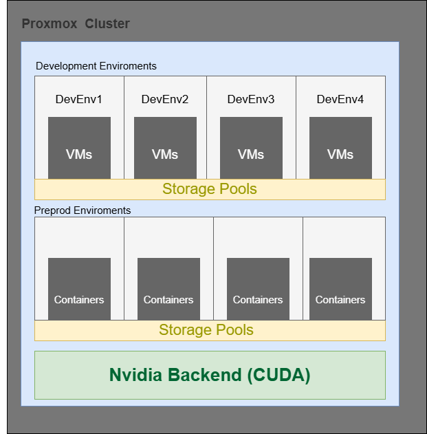

# Demostrador de Inteligencia Artificial Educativo

## Visión general

Plataforma integral de inteligencia artificial diseñada como entorno educativo de alto rendimiento para 10 alumnos, proporcionando una infraestructura completa que simula escenarios reales de desarrollo, preproducción y producción de sistemas IA.

Centros colaboradores

| Profesor  | Centro |
|-----------|-----------|
| Daniel Espiñeira   | Celda 2   |
| Mikel Díez   | Celda 4   |

## Capacidades clave

- **Entorno multi-usuario**: Soporte para 10 alumnos trabajando simultáneamente
- **Recursos computacionales escalables**: Potencia de cálculo dedicada para entrenamientos complejos
- **Arquitectura multi-entorno**: Simulación real de ciclos de desarrollo profesionales
- **Infraestructura de vanguardia**: Hardware especializado para cargas de trabajo IA

## Stack tecnológico

### Infraestructura y virtualización
- **Proxmox VE**: Hipervisor para orquestar entornos virtualizados
- **Linux (Ubuntu/Debian)**: Sistema operativo base optimizado
- **Docker/Kubernetes**: Contenedores para despliegue consistente
- **NVIDIA CUDA**: Aceleración GPU para procesamiento paralelo

### Desarrollo IA
- **Python**: Lenguaje principal para desarrollo
- **PyTorch/TensorFlow**: Frameworks de aprendizaje profundo
- **Hugging Face Transformers**: Biblioteca para modelos de lenguaje
- **NVIDIA TensorRT**: Optimización de inferencia
- **OpenCV/MediaPipe**: Procesamiento y análisis de imágenes
- **Langchain/LlamaIndex**: Integración de modelos de lenguaje

### MLOps
- **MLflow**: Gestión del ciclo de vida de modelos
- **Git/Gitlab**: Control de versiones para datos
- **Weights & Biases**: Seguimiento de experimentos
- **FastAPI/Flask**: APIs para servicios de modelos

### Almacenamiento y datos
- **PostgreSQL/MongoDB**: Bases de datos para aplicaciones
- **MinIO/S3**: Almacenamiento de objetos
- **Redis**: Caché de alta velocidad

### Monitorización
- **Prometheus/Grafana**: Supervisión de rendimiento
- **ELK Stack**: Análisis de logs y eventos

## Diagrama General

*Arquitectura general del sistema de demostración IA*

## Recursos

### Repositorios

Repositorios

| Repositorio | Descripción |
|------------|-------------|
| [demo-ia-infra](https://github.com/mikel-diez/demostradorcicd-infra) | Infraestructura y configuración del sistema |
| [demo-ia-mlops](https://github.com/mikel-diez/demostradorcicd-mlops) | Herramientas y flujos MLOps |
| [demo-ia-apps](https://github.com/mikel-diez/demostradorcicd-app) | Aplicaciones y casos de uso |
| [demo-ia-docs](https://github.com/mikel-diez/demostradorcicd) | Documentación del proyecto |

Estos repos se pueden encontrar dentro del proyecto

[Proyecto Demostrador CICD](https://github.com/users/mikel-diez/projects/1)

### Documentacion 

[📄 Descargar documentación completa en PDF](assets/docs/DemostradorIACICD.pdf)

## Casos de uso

- Desarrollo de aplicaciones de IA generativa (texto, imagen)
- Sistemas de visión artificial y reconocimiento de objetos
- Procesamiento de lenguaje natural y chatbots
- Despliegue y monitorización de modelos en producción
- Optimización de rendimiento para inferencia en tiempo real

